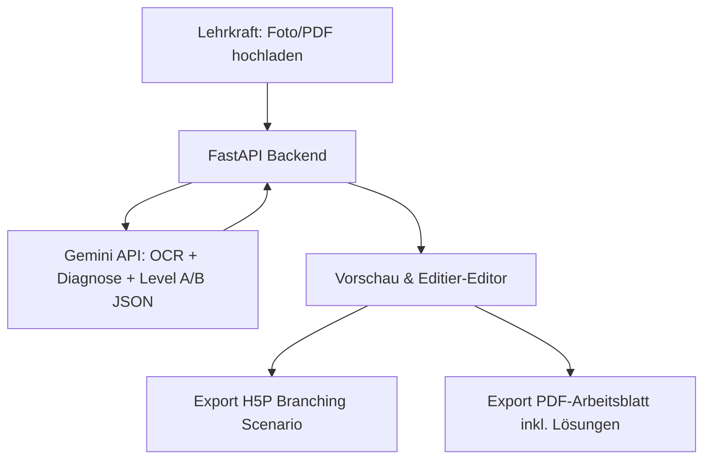

# Adaptify
 
Adaptify ist ein minimalistisches Web-Tool für Lehrkräfte zur vollautomatischen Differenzierung von Unterrichtsmaterialien. Es nutzt modernste KI (Google Gemini) zur Textextraktion (OCR) und Aufgaben-Generierung. Schüler durchlaufen ein adaptives H5P-Szenario, das sie basierend auf einem kurzen Einstiegstest unbemerkt auf ihr passendes Niveau leitet.

## Systemarchitektur & Ablauf



## Features

1. **OCR & KI-Generierung**: Liest handschriftliche oder gedruckte Texte direkt aus Scans/Fotos/PDFs.
2. **Automatischer Diagnosetest**: Erzeugt 2–3 Einstiegsfragen.
3. **Adaptives Routing**: Verzweigt Schüler unbemerkt auf Level A (Fördern: sprachlich entlastet, Lückentext mit Hilfen) oder Level B (Fordern: komplexerer Satzbau, Transferaufgaben).
4. **Offline-Notfall-PDF**: Generiert ein zweiseitiges Arbeitsblatt (inklusive Lösungsblatt für die Lehrkraft) aus denselben Daten.
5. **Plug & Play**: Das H5P-Paket ist ein standardkonformes "Branching Scenario", das in jedem gängigen LMS (Moodle, ByCS, Canvas) ohne Vorkonfiguration funktioniert.

## Installation & Start

### Voraussetzungen

- Python 3.9 oder neuer
- Ein Google Gemini API-Key (erhältlich unter [Google AI Studio](https://aistudio.google.com/))

### Setup-Schritte

1. Navigiere in das Projektverzeichnis:
   ```bash
   cd C:\Users\Thomas\Desktop\AdaptiH5P\backend
   ```

2. Installiere die Python-Abhängigkeiten:
   ```bash
   pip install -r requirements.txt
   ```

3. Setze deinen Gemini API-Key in der Umgebungsvariable (PowerShell):
   ```powershell
   $env:GEMINI_API_KEY="DEIN_API_KEY_HIER"
   ```

4. Starte den FastAPI-Server:
   ```bash
   python main.py
   ```

5. Öffne die Anwendung im Browser:
   [http://localhost:8000](http://localhost:8000)

## Demo-Modus

Wenn kein `GEMINI_API_KEY` gesetzt ist, startet die App automatisch im **Demo-Modus**. Sie können ein beliebiges Bild/PDF hochladen und erhalten ein voll funktionsfähiges, differenziertes Übungspaket für Englisch (Klasse 6) als Anschauungsbeispiel.
